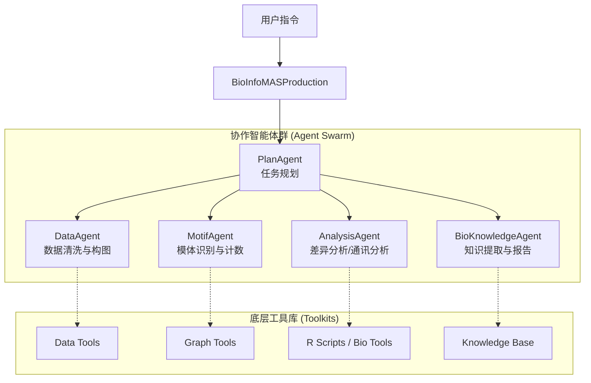

# 🧬 CCMAS - Cell Communication Multi-Agent System


![Deepwiki].(https://deepwiki.com/Springff/CCMAS).

**CCMAS (Cell Communication Multi-Agent System)** 是一个生产级生物信息学多智能体协作系统。该系统深度整合 **AutoGen** 框架与 **LLM（大语言模型）**，专为复杂的单细胞/空间转录组分析、细胞模体识别及生物知识提取而设计。

> 🔬 **核心概念：细胞模体 (Cell Motif)**
> 指在基于细胞空间位置构建的图网络中，频繁出现且具有统计学显著性的特定细胞组合模式，通常暗示着关键的微环境相互作用。

---

## 📑 目录

- [✨ 核心特性](#-核心特性)
- [🏗️ 系统架构](#️-系统架构)
- [🚀 快速开始](#-快速开始)
- [📖 使用指南](#-使用指南)
- [📂 项目结构](#-项目结构)
- [🔧 工具与API](#-工具与api)
- [📚 依赖与环境](#-依赖与环境)
- [❓ 常见问题](#-常见问题)

---

## ✨ 核心特性

| 模块 | 描述 |
| :--- | :--- |
| **🤖 多智能体协作** | 5个专业智能体（规划、数据、模体、分析、知识）通过自然语言交互协作 |
| **🧠 LLM 驱动内核** | 基于 GPT-4/LLM 的任务拆解、逻辑推理与动态决策能力 |
| **🔧 全栈工具链** | 集成 Python (PyTorch/Scikit-learn) 与 R (CellChat/Seurat) 生态 |
| **🕸️ 网络模体挖掘** | 自动化构建细胞空间图，识别高频空间模体子图 |
| **📊 多维生信分析** | 支持 DEG（差异表达分析）、通路富集及细胞通讯推断 |
| **📝 智能报告生成** | 自动生成包含统计图表与生物学意义解读的结构化报告 |

---

## 🏗️ 系统架构

CCMAS 采用分层控制架构，由 `BioInfoMASProduction` 作为中央协调器，调度下游垂类智能体。



### 智能体职能表

| 智能体 | 角色 | 核心职责 |
| :--- | :--- | :--- |
| **PlanAgent** | 🧠 大脑 | 需求理解、工作流设计、任务分发与进度监控 |
| **DataAgent** | 🧹 数据工 | 空间数据读取、稀疏矩阵处理、图网络构建 (Graph Construction) |
| **MotifAgent** | 🕸️ 侦探 | 候选模体搜索、同构子图匹配、频率计算与显著性检验 |
| **AnalysisAgent** | 📊 分析师 | 调用 R 脚本执行 CellChat、DESeq2 分析，统计绘图 |
| **BioKnowledgeAgent** | 📝 专员 | 结合文献库解读结果，撰写生物学意义报告 |

---

## 🚀 快速开始

### 1. 环境准备

建议使用 `conda` 创建隔离环境以避免依赖冲突。

```bash
# 创建并激活环境
conda create -n ccmas python=3.10
conda activate ccmas

# 克隆项目
git clone https://github.com/your-repo/CCMAS.git
cd CCMAS
```

### 2. 安装依赖

```bash
# 安装 Python 核心依赖
pip install -r requirements.txt

# (可选) 确保系统中安装了 R 语言环境及必要的 R 包 (CellChat, Seurat)
# Rscript tools/install_r_packages.r
```

### 3. 配置密钥

在项目根目录创建 `.env` 文件：

```ini
# .env 文件配置
LLM_API_KEY=sk-xxxxxxxxxxxxxxxxxxxxxxxx
LLM_MODEL_ID=gpt-4-turbo
LLM_BASE_URL=https://api.openai.com/v1

# AutoGen 系统配置
AUTOGEN_TIMEOUT=600
AUTOGEN_CACHE_SEED=42
```

---

## 📖 使用指南

### 场景 A：全自动分析 (推荐)

只需提供自然语言指令，系统自动规划路径。

```python
from system_production import BioInfoMASProduction

# 1. 初始化生产环境系统
system = BioInfoMASProduction(verbose=True)

# 2. 定义研究目标 (支持自然语言)
goal = """
请对 PDAC (胰腺导管腺癌) 数据集进行完整分析：
1. 数据源：
   - 空间坐标：./data/spatial_loc.csv
   - 表达矩阵：./data/counts_matrix.mtx
2. 任务：
   - 构建细胞空间网络
   - 识别 Top-3 频繁出现的细胞模体
   - 分析这些模体中细胞间的通讯关系
"""

# 3. 执行分析
results = system.run_analysis(research_goal=goal)

# 4. 导出结果
save_path = system.save_results(output_dir="./outputs/pdac_analysis")
print(f"✅ 报告已生成至: {save_path}")
```

### 场景 B：分步模块化调用

```python
# 单独使用模体识别功能
from tools.motif_tools import identify_motif
from tools.data_tools import construct_cell_graph

# 构建图
graph_data = construct_cell_graph("data/spatial.csv")

# 识别模体
motifs = identify_motif(graph_data, n_motifs=5)
print(motifs)
```

---

## 📂 项目结构

```text
CCMAS/
├── 📄 system_production.py      # 系统入口类 (Orchestrator)
├── 📄 autogen_framework.py      # AutoGen 框架配置封装
├── 📄 requirements.txt          # 项目依赖列表
├── 📂 agents/                   # [核心] 智能体定义
│   ├── plan_agent.py            # 任务规划
│   ├── data_agent.py            # 数据处理
│   ├── motif_agent.py           # 模体分析
│   ├── analysis_agent.py        # 生物信分析
│   └── bioknowledge_agent.py    # 知识总结
├── 📂 tools/                    # [核心] 工具函数库
│   ├── data_tools.py            # 图构建与矩阵处理
│   ├── motif_tools.py           # 子图同构算法
│   ├── biomedknowledge_tools.py # 知识库接口
│   └── analysis_tools/          # R/Python 分析脚本
│       ├── cellchat.r           # 细胞通讯脚本
│       └── DEA.r                # 差异表达脚本
└── 📂 examples/                 # 示例数据与脚本
```

---

## 🔧 工具与API

### BioInfoMASProduction 类

| 方法 | 参数 | 返回 | 说明 |
| :--- | :--- | :--- | :--- |
| `__init__` | `config`, `verbose` | - | 初始化系统与智能体池 |
| `run_analysis` | `research_goal` | `Dict` | 执行端到端分析任务 |
| `save_results` | `output_dir` | `str` | 序列化保存结果与日志 |
| `register_tools` | - | - | 动态挂载工具函数到 LLM |

### 集成工具集

*   **数据层**: `construct_cell_graph`, `txt2mtx`, `normalize_data`
*   **算法层**: `candidate_trangle_motifs` (三角形模体搜索), `subgraph_isomorphism` (子图同构)
*   **分析层**: `DE_analysis` (Wilcoxon/DESeq2), `cellchat_process` (R接口)

---

## 📚 依赖与环境

本项目主要依赖于以下库（完整列表见 `requirements.txt`）：

*   **Core**: `pyautogen>=0.2`, `openai>=1.0`
*   **Data**: `pandas`, `numpy`, `scipy`
*   **Bio/Graph**: `scanpy`, `python-igraph`, `torch`
*   **R Dependencies**: `CellChat`, `Seurat`, `Matrix`

---

## ❓ 常见问题 (FAQ)

**Q1: 运行 R 脚本时报错 `Command not found`？**
> 请确保系统环境变量中已配置 R 语言路径，且在 `tools/analysis_tools` 目录下的 R 脚本具有执行权限。

**Q2: 模体识别速度较慢？**
> 模体识别涉及子图同构匹配（NP-hard问题）。对于超过 10万个细胞的数据集，建议在 `DataAgent` 中先进行下采样或划分子区域。

**Q3: 遇到 `RateLimitError`？**
> 请检查 `.env` 中的 API Key 是否有余额，或尝试切换 `LLM_MODEL_ID` 为更轻量的模型（如 `gpt-3.5-turbo`）进行测试。

---

## 🤝 贡献与支持

欢迎提交 Pull Request 或 Issue！

*   **主要作者**: BioInfoMAS Team
*   **版本**: 1.0.0 (2025 Release)
*   **许可证**: MIT License

---

*Made with ❤️ for Bioinformatics Research*
