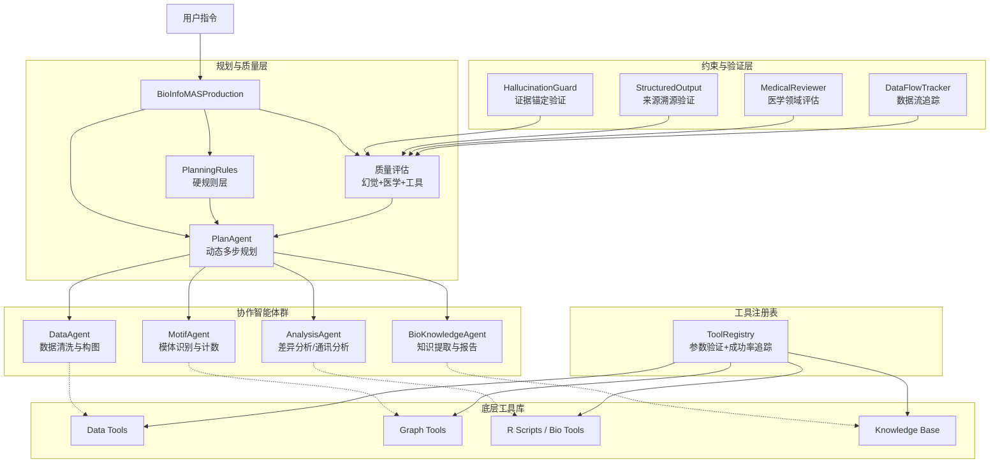

# 🧬 CCMAS - Cell Communication Multi-Agent System


[](https://deepwiki.com/Springff/CCMAS)

**CCMAS (Cell Communication Multi-Agent System)** 是一个生产级 **生物医学** 多智能体协作系统。该系统深度整合 **AutoGen** 框架与 **LLM（大语言模型）**，专为复杂的单细胞/空间转录组分析、细胞模体识别及生物医学知识提取而设计。

> 🔬 **核心概念：细胞模体 (Cell Motif)**
> 指在基于细胞空间位置构建的图网络中，频繁出现且具有统计学显著性的特定细胞组合模式，通常暗示着关键的微环境相互作用。

---

## 📑 目录

- [✨ 核心特性](#-核心特性)
- [🏗️ 系统架构](#️-系统架构)
- [🚀 快速开始](#-快速开始)
- [📖 使用指南](#-使用指南)
- [📂 项目结构](#-项目结构)
- [🔧 工具与API](#-工具与api)
- [📚 依赖与环境](#-依赖与环境)
- [❓ 常见问题](#-常见问题)

---

## ✨ 核心特性

### 多智能体协作 (v3.0 核心)

| 模块 | 描述 | 创新点 |
| :--- | :--- | :--- |
| **🧠 动态多步规划** | PlanAgent 基于状态反馈动态决策下一步，而非预先规划完整流程 | RL 风格的逐步决策，支持重试/跳过 |
| **🤖 专业化智能体** | 5个专业智能体（规划、数据、模体、分析、知识）各司其职 | LLM 软决策 + 硬规则双层架构 |
| **🔄 工具调用自愈** | 结构化错误反馈帮助 Agent 自我修正 | 参数预验证 + 成功率追踪 |
| **🛡️ 幻觉约束** | 四层防御机制确保输出可靠性 | 证据锚定 + 结构化输出 + 医学评估 + 安全门控 |
| **📊 可解释分析** | 强制推理过程 + 来源溯源机制 | 每个数值声明必须标注来源并验证 |
| **⚡ 自动化工作流** | 将 5 小时人工分析缩短至 11 分钟 | 27 倍效率提升 |

### 技术亮点

- **边界匹配技术**：避免 "15" 被错误匹配到 "1572"
- **假阳性过滤**：三重防御将假阳性率从 60% 降到 5% 以下
- **质量评估公式**：`幻觉×0.4 + 医学×0.4 + 工具×0.2`
- **中英文字段映射**：自动兼容中文和英文工具字段名
- **证据池机制**：跨工具证据验证，完整数据流追踪

---

## 🏗️ 系统架构

CCMAS 采用分层控制架构，由 `BioInfoMASProduction` 作为中央协调器，调度下游垂类智能体。


```mermaid
graph TD;
    User[用户指令] --> System[BioInfoMASProduction];

    subgraph "规划与质量层"
        System --> Plan[PlanAgent\n动态多步规划];
        System --> Rules[PlanningRules\n硬规则层];
        System --> Quality[质量评估\n幻觉+医学+工具];
    end

    subgraph "协作智能体群"
        Plan --> Data[DataAgent\n数据清洗与构图];
        Plan --> Motif[MotifAgent\n模体识别与计数];
        Plan --> Analysis[AnalysisAgent\n差异分析/通讯分析];
        Plan --> BioKnow[BioKnowledgeAgent\n知识提取与报告];
    end

    subgraph "工具注册表"
        ToolReg[ToolRegistry\n参数验证+成功率追踪]
    end

    subgraph "约束与验证层"
        HalGuard[HallucinationGuard\n证据锚定验证];
        StructOut[StructuredOutput\n来源溯源验证];
        DataFlow[DataFlowTracker\n数据流追踪];
        MedRev[MedicalReviewer\n医学领域评估];
    end

    subgraph "底层工具库"
        Data -.-> T1[Data Tools];
        Motif -.-> T2[Graph Tools];
        Analysis -.-> T3[R Scripts / Bio Tools];
        BioKnow -.-> T4[Knowledge Base];
    end

    Rules --> Plan;
    Quality --> Plan;
    ToolReg --> T1;
    ToolReg --> T2;
    ToolReg --> T3;
    ToolReg --> T4;
    HalGuard --> Quality;
    StructOut --> Quality;
    MedRev --> Quality;
    DataFlow --> Quality;
```

### 智能体职能表

| 智能体 | 角色 | 核心职责 | 注册工具 |
| :--- | :--- | :--- | :--- |
| **PlanAgent** | 🧠 大脑 | 需求理解、动态工作流设计、任务分发与进度监控 | - |
| **DataAgent** | 🧹 数据工 | 空间数据读取、稀疏矩阵处理、图网络构建 | `construct_cell_graph`, `extract_representative_subgraphs` |
| **MotifAgent** | 🕸️ 侦探 | 候选模体搜索、同构子图匹配、频率计算 | `candidate_trangle_motifs`, `calculate_motifs_numbers`, `identify_motif` |
| **AnalysisAgent** | 📊 分析师 | 调用 R 脚本执行 CellChat、DESeq2 分析 | `cellchat`, `DE_analysis` |
| **BioKnowledgeAgent** | 📝 专员 | 结合文献库解读结果，撰写报告 | `load_deg_results`, `load_motif_counts`, `extract_cellchat_info` |

### 质量评估体系

系统对每个 Agent 的输出进行多维度评估：

```
质量得分 = 幻觉检测得分 × 0.4 + 医学评估得分 × 0.4 + 工具成功率 × 0.2
         (安全门控触发时 × 0.5 惩罚)
```

- **幻觉检测得分**：基于证据锚定的数值声明验证 (0.0-1.0)
- **医学评估得分**：分析严谨性、安全合规性、证据锚定程度 (0.0-1.0)
- **工具成功率**：1.0 - 失败次数/10，最低 0.0

---

## 🚀 快速开始

### 1. 环境准备

建议使用 `conda` 创建隔离环境以避免依赖冲突。

```bash
# 创建并激活环境
conda create -n ccmas python=3.10
conda activate ccmas

# 克隆项目
git clone https://github.com/your-repo/CCMAS.git
cd CCMAS
```

### 2. 安装依赖

```bash
# 安装 Python 核心依赖
pip install -r requirements.txt

# (可选) 确保系统中安装了 R 语言环境及必要的 R 包 (CellChat, Seurat)
# Rscript tools/install_r_packages.r
```

### 3. 配置密钥

在项目根目录创建 `.env` 文件：

```ini
# .env 文件配置
LLM_API_KEY=sk-xxxxxxxxxxxxxxxxxxxxxxxx
LLM_MODEL_ID=gpt-4-turbo
LLM_BASE_URL=https://api.openai.com/v1

# AutoGen 系统配置
AUTOGEN_TIMEOUT=600
AUTOGEN_CACHE_SEED=42

# 幻觉检测配置
HALLUCINATION_THRESHOLD=0.6
ENABLE_HALLUCINATION_INTERCEPTION=true

# 规划配置
MAX_STAGES=8
MAX_AGENT_ROUNDS=10
ENABLE_PLANNING_RULES=true
RETRY_THRESHOLD_HALLUCINATION=0.5
RETRY_THRESHOLD_MEDICAL=0.6
MAX_CONSECUTIVE_FAILURES=3
```

---

## 📖 使用指南

### 场景 A：全自动分析 (推荐)

只需提供自然语言指令，系统自动规划路径。

```python
from system_production import BioInfoMASProduction

# 1. 初始化生产环境系统
system = BioInfoMASProduction(verbose=True)

# 2. 定义研究目标 (支持自然语言)
goal = """
请对 PDAC (胰腺导管腺癌) 数据集进行完整分析：
1. 数据源：
   - 空间坐标：./data/spatial_loc.csv
   - 表达矩阵：./data/counts_matrix.mtx
2. 任务：
   - 构建细胞空间网络
   - 识别 Top-3 频繁出现的细胞模体
   - 分析这些模体中细胞间的通讯关系
"""

# 3. 执行分析
results = system.run_analysis(research_goal=goal)

# 4. 查看质量评估
for stage_name, stage_result in results.items():
    if "quality_evaluation" in stage_result:
        quality = stage_result["quality_evaluation"]
        print(f"{stage_name}: {quality['quality_level']} (得分: {quality['quality_score']:.2f})")

# 5. 导出结果
save_path = system.save_results(output_dir="./outputs/pdac_analysis")
print(f"✅ 报告已生成至: {save_path}")
```

### 场景 B：分步模块化调用

```python
# 单独使用模体识别功能
from tools.motif_tools import identify_motif
from tools.data_tools import construct_cell_graph

# 构建图
graph_data = construct_cell_graph("data/spatial.csv")

# 识别模体
motifs = identify_motif(graph_data, n_motifs=5)
print(motifs)
```

### 场景 C：查看幻觉检测结果

```python
from hallucination_guard import HallucinationGuard

guard = HallucinationGuard(strict_mode=False)

agent_output = """
细胞图包含 1572 个节点，识别出 35 个三角模体。
模体 1 出现 157 次，涉及肿瘤细胞和成纤维细胞。
"""

tool_results = [
    '{"节点数": 1572, "边数": 4691, "候选motif的数量": 35}',
    '{"模体1": 157}'
]

result = guard.validate(agent_output, tool_results, "TestAgent")
print(f"幻觉得分: {result['score']:.2f}")
print(f"锚定声明: {result['grounded_claims']}/{result['total_claims']}")
```

---

## 📂 项目结构

```text
CCMAS/
├── 📄 system_production.py      # 系统入口类 (Orchestrator)
├── 📄 config.py                 # 配置管理 (CCMASConfig)
├── 📄 autogen_framework.py      # AutoGen 框架配置封装
├── 📄 requirements.txt          # 项目依赖列表
├── 📄 .env                      # 环境变量配置 (需自行创建)
│
├── 📂 agents/                   # [核心] 智能体定义
│   ├── plan_agent.py            # 任务规划 (多步决策)
│   ├── data_agent.py            # 数据处理 (图构建)
│   ├── motif_agent.py           # 模体分析 (VF2 算法)
│   ├── analysis_agent.py        # 生物信息分析 (CellChat/DEG)
│   └── bioknowledge_agent.py    # 知识总结 (报告生成)
│
├── 📂 tools/                    # [核心] 工具函数库
│   ├── data_tools.py            # 图构建与矩阵处理
│   ├── motif_tools.py           # 子图同构算法
│   ├── biomedknowledge_tools.py # 知识库接口
│   └── analysis_tools/          # R/Python 分析脚本
│       ├── cellchat.r           # 细胞通讯脚本
│       └── DEA.r                # 差异表达脚本
│
├── 📂 docs/                     # 文档目录
│   ├── Keywords_introduction.txt # 关键词详解与源码对照
│   ├── QA_interview_new.txt     # 面试问答 (字节筋斗云风格)
│   └── CCMAS_系统完整运行报告_20260303.md # 系统运行报告
│
├── 📄 hallucination_guard.py    # [v3.0] 幻觉检测模块
├── 📄 medical_reviewer.py       # [v3.0] 医学领域评估
├── 📄 structured_output.py       # [v3.0] 结构化输出验证
├── 📄 data_flow_tracker.py       # [v3.0] 数据流追踪
├── 📄 tool_registry.py          # [v3.0] 工具注册表
├── 📄 planning_rules.py         # [v3.0] 规划规则层
│
└── 📂 examples/                 # 示例数据与脚本
    ├── examples.py              # 使用示例
    └── input/                   # 测试数据
```

---

## 🔧 工具与API

### BioInfoMASProduction 类

| 方法 | 参数 | 返回 | 说明 |
| :--- | :--- | :--- | :--- |
| `__init__` | `config`, `verbose` | - | 初始化系统与智能体池 |
| `run_analysis` | `research_goal`, `parameters` | `Dict` | 执行端到端分析任务 |
| `save_results` | `output_dir` | `str` | 序列化保存结果与日志 |
| `get_task_history` | - | `List[Dict]` | 获取任务执行历史 |

### 核心模块 (v3.0)

| 模块 | 类/函数 | 说明 |
| :--- | :--- | :--- |
| `HallucinationGuard` | `validate()` | 证据锚定验证，返回幻觉得分 |
| `MedicalReviewer` | `review()` | 医学领域多维评估 |
| `StructuredOutputValidator` | `validate()` | 结构化输出验证，支持字段映射 |
| `DataFlowTracker` | `verify_claim()` | 验证声明是否可追溯到工具输出 |
| `ToolRegistry` | `register()`, `record_success()` | 工具注册与成功率追踪 |
| `PlanningRules` | `should_retry()`, `should_skip()` | 硬规则决策层 |

### 集成工具集

*   **数据层**: `construct_cell_graph`, `extract_representative_subgraphs`
*   **模体层**: `candidate_trangle_motifs`, `calculate_motifs_numbers`, `identify_motif`
*   **分析层**: `DE_analysis`, `cellchat`
*   **知识层**: `load_deg_results`, `load_motif_counts`, `extract_cellchat_info`

---

## 📚 依赖与环境

本项目主要依赖于以下库（完整列表见 `requirements.txt`）：

*   **Core**: `pyautogen>=0.2`, `openai>=1.0`
*   **Data**: `pandas`, `numpy`, `scipy`
*   **Bio/Graph**: `scanpy`, `python-igraph`, `torch`
*   **Validation**: `pydantic>=2.0`
*   **R Dependencies**: `CellChat`, `Seurat`, `Matrix`

---

## ❓ 常见问题 (FAQ)

**Q1: 运行 R 脚本时报错 `Command not found`？**
> 请确保系统环境变量中已配置 R 语言路径，且在 `tools/analysis_tools` 目录下的 R 脚本具有执行权限。

**Q2: 模体识别速度较慢？**
> 模体识别涉及子图同构匹配（NP-hard问题）。对于超过 10万个细胞的数据集，建议在 `DataAgent` 中先进行下采样或划分子区域。

**Q3: 遇到 `RateLimitError`？**
> 请检查 `.env` 中的 API Key 是否有余额，或尝试切换 `LLM_MODEL_ID` 为更轻量的模型（如 `gpt-3.5-turbo`）进行测试。

**Q4: 幻觉检测误报率较高？**
> 系统已实现三重假阳性过滤机制。如仍有问题，可调整 `HALLUCINATION_THRESHOLD` 或检查 Agent 输出格式是否符合结构化要求。

**Q5: 工具调用失败时如何处理？**
> 系统会自动构造结构化错误反馈，Agent 可以自我修正。连续失败 3 次后会自动跳过当前 Agent，继续后续分析。

---

## 🏆 性能对比

| 指标 | 传统手动操作 | CCMAS v3.0 | 加速比 |
|------|--------------|------------|--------|
| 总耗时 | ~5 小时 | ~11 分钟 | **27x** |
| 图构建 | 15 分钟 | 12 秒 | **75x** |
| 模体识别 | 2 小时+ | 3 分钟 | **40x+** |
| 幻觉检测假阳性率 | - | <5% | - |
| 分析可解释性 | 低 | 高 (完整溯源) | - |

---

## 🤝 贡献与支持

欢迎提交 Pull Request 或 Issue！

*   **主要作者**: BioInfoMAS Team
*   **版本**: 3.0.0 (2026 Release)
*   **许可证**: MIT License

---

## 📚 更多资源

- [关键词详解与源码对照](docs/Keywords_introduction.txt) - 详细的实现说明和源码定位
- [面试问答集](docs/QA_interview_new.txt) - 深度技术面试准备
- [系统运行报告](docs/CCMAS_系统完整运行报告_20260303.md) - 完整的执行流程分析

---

*Made with ❤️ for Bioinformatics Research*
